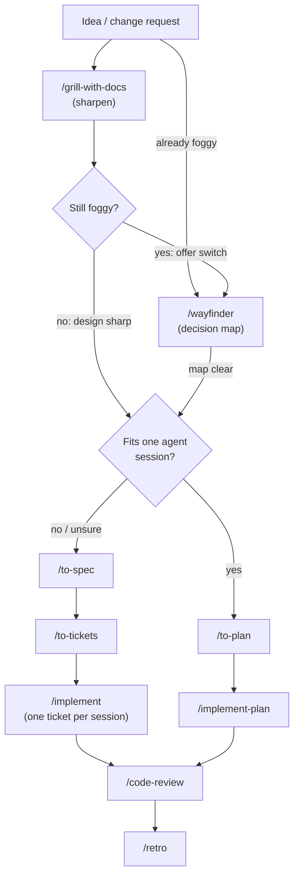

# my-agent-skills

Personal [Cursor Agent Skills](https://cursor.com/docs/skills) tuned for day-to-day engineering work. Skills also work with other agents that load the same `.agents/skills/` layout. Credit for adapted and upstream skills is in **References** below.

---

## Install

**Requires Node ≥ 20.** From any directory, run:

```bash
npx my-agent-skills@latest
```

Confirm the `npx` install prompt if asked, then use the interactive menu:

my-agent-skills hub menu: Add, Update, Remove, List, Sync/Restore, Check, Quit

The CLI walks you through **project** vs **global** scope, then **install target** (Cursor `.agents/skills/`, Claude Code `.claude/skills/`, or both), and which skills to install.

Skills land under the selected target directories; what you installed is recorded in `.agents/cursor-skills-lock.json` (one lock for all targets). Some skills pull in `dependsOn` siblings automatically (see [skills.json](./skills.json)).

**After cloning a team repo** that commits the lockfile: run the CLI again and choose **Sync/Restore Skills from Lockfile** (same project scope as before). Commit the lockfile to git; gitignore `.agents/skills/` and `.claude/skills/` (the installed trees).

Flags like `-p`, `-y`, `--target`, and `--json` are for scripts and CI only. Full CLI docs: [npm](https://www.npmjs.com/package/my-agent-skills) · [source](./cli/README.md).

### Other installer (optional)

[Vercel’s open skills CLI](https://github.com/vercel-labs/skills) (`npx skills add …`) is a separate ecosystem with different lockfiles and paths. This collection uses `my-agent-skills` above.

---

## Recommended Dev Workflow

Defaults: local markdown under `work/`, single-context `CONTEXT.md` / `docs/adr/`. Optional [`/setup-work`](./skills/setup-work/) when you need GitHub/GitLab/custom tracker, multi-context domain layout under `docs/agents/`, or a reviewer-owned `CODING_STANDARDS.md` seed.

Start with an idea: `**/grill-with-docs**` to sharpen against the repo. If it's already clearly foggy, go straight to `**/wayfinder**`. After the design is sharp enough to build, pick a path by **context risk**: would clearing the chat mid-build force you to re-derive seams and contracts?

**Fog** means you know roughly where you want to end up, but the open decisions (and what depends on what) are not clear enough to write a spec or one-session plan yet: usually more than one agent session of deciding before building.




| Stage                    | Skills                                    | Notes                                                                                                                                                                                               |
| ------------------------ | ----------------------------------------- | --------------------------------------------------------------------------------------------------------------------------------------------------------------------------------------------------- |
| Sharpen                  | `/grill-with-docs`                        | Default entry with an idea. May offer `/wayfinder` when destination is nameable and fog appears.                                                                                                    |
| Decide in fog            | `/wayfinder`                              | Decision tickets, not build slices. Enter directly when already foggy, or continue from a grill fog offer. See [Working a wayfinder map](#working-a-wayfinder-map).                                 |
| Spec path (default)      | `/to-spec` → `/to-tickets` → `/implement` | Multi-session / dumb-zone risk. One ticket per session; prefer `/tdd` at agreed seams.                                                                                                              |
| Plan path (escape hatch) | `/to-plan` → `/implement-plan`            | Only when the whole build fits one context window.                                                                                                                                                  |
| Review                   | `/code-review`                            | After implementation. Needs the [Thermos](https://cursor.com/marketplace/cursor/thermos) plugin. Report only. Reads `CODING_STANDARDS.md` when present; may nominate rules (writes only on accept). |
| Environment              | `/retro`                                  | After a session (often after review). Propose pointers, checks, reviewer standards, tool economy; apply only accepted candidates.                                                                   |


### Working a wayfinder map

Two complementary ways to burn down decision tickets — do **not** merge unblocked tickets into one resolve pass (each ticket stays one decision, one pass).

- **Serial (same agent):** `/wayfinder` Work through the map to resolve one ticket, then you will be prompted to **Continue next** / **Handoff** (`/handoff` → fresh session on the map) / **Stop**. Soft context bias prefers Handoff around ~60% / ~120k. Continue takes the next unclaimed frontier ticket in order.
- **Parallel (multiple agents):** when several tickets are on the frontier (open, unblocked, unclaimed), open a new agent per ticket, tag that issue, and run `/wayfinder` on it. Claiming (assignee) keeps sessions from colliding. This stays manual since you spawn the agents. The map’s blocking edges show what’s takeable. Most frontier tickets are HITL grilling, so start only as many parallel sessions as you can actually answer without overloading yourself. Width is optional throughput, not a requirement.

Charting may still fire multiple AFK `/research` Tasks in parallel; that exception is for facts, not HITL grilling.

**Optional orient:** `/setup-work` when defaults (local `work/`, single-context domain) are wrong, or to seed `CODING_STANDARDS.md`. **Also sharpening:** `/grill-me` when you want grilling without domain-modeling. **Bugs:** `/diagnosing-bugs`. **Architecture debt:** `/improve-codebase-architecture`. **Environment:** `/retro` after a session.

Hard stops are intentional: `/to-spec`, `/to-plan`, and `/to-tickets` do not start the next stage unless you ask in the same turn. Clear context between sessions on the ticket path.

---

## Recommended Cursor plugins

Cursor marketplace plugins that pair well with these skills:

- [Context7](https://cursor.com/marketplace/upstash)
- [Exa](https://cursor.com/marketplace/exa)
- [Thermos](https://cursor.com/marketplace/cursor/thermos)
- [Docs Canvas](https://cursor.com/marketplace/cursor/docs-canvas)
- [Cursor Team Kit](https://cursor.com/marketplace/cursor/cursor-team-kit)

---

## Skill catalog

**43** skills under [skills/](./skills/). Pack manifest: [skills.json](./skills.json).


| Folder                                                                   | `name`                          | One-line intent                                                                                                                                                                                                                                      |
| ------------------------------------------------------------------------ | ------------------------------- | ---------------------------------------------------------------------------------------------------------------------------------------------------------------------------------------------------------------------------------------------------- |
| [architecture-decision-records](./skills/architecture-decision-records/) | `architecture-decision-records` | Owns lightweight ADRs with detailed rationale, optional expanded sections, scaffolding, and `docs/adr/README.md` index maintenance (draft → approval → write).                                                                                       |
| [best-practices-research](./skills/best-practices-research/)             | `best-practices-research`       | Recon current best practices per domain via live web search (Exa-first) before implementing; fans out one **Task** subagent per unrelated domain.                                                                                                    |
| [code-review](./skills/code-review/)                                     | `code-review`                   | User-invoked diff/PR review: council → thermos/`yagni` → delta BPR → Sol merge. Report only. Reads `CODING_STANDARDS.md`; nominates rules (write on accept). Requires Thermos plugin.                                                                |
| [codebase-design](./skills/codebase-design/)                             | `codebase-design`               | Shared vocabulary for designing deep modules (interface, seam, depth, leverage, locality) and deepening or design-it-twice patterns.                                                                                                                 |
| [codebase-onboarding](./skills/codebase-onboarding/)                     | `codebase-onboarding`           | Analyze an unfamiliar codebase and produce a structured onboarding guide, architecture map, conventions, and starter `AGENTS.md` for Cursor.                                                                                                         |
| [commit-msg](./skills/commit-msg/)                                       | `commit-msg`                    | User-invoked: draft one-liner commit messages from staged changes matching this repo's history; the picked line is the commit. No attributions.                                                                                                      |
| [council](./skills/council/)                                             | `council`                       | Recon a codebase area via parallel Task/Agent dives, then return a cited brief.                                                                                                                                                                      |
| [deep-research](./skills/deep-research/)                                 | `deep-research`                 | User-invoked multi-phase deep dive (product/market lens by default) that writes a navigable multi-page HTML report pack under `docs/research/<topic-slug>/`.                                                                                         |
| [diagnosing-bugs](./skills/diagnosing-bugs/)                             | `diagnosing-bugs`               | Disciplined diagnosis loop: build a tight red-capable feedback loop, reproduce, minimise, hypothesise, instrument, fix, regression-test.                                                                                                             |
| [docker-patterns](./skills/docker-patterns/)                             | `docker-patterns`               | Apply Dockerfile, Docker Compose, BuildKit, and container security patterns for local dev and hardened deployable images.                                                                                                                            |
| [document](./skills/document/)                                           | `document`                      | Create or update durable repo docs (README, API, runbooks) verified against code; prune stale docs in the touched area.                                                                                                                              |
| [domain-modeling](./skills/domain-modeling/)                             | `domain-modeling`               | Build and sharpen the project's domain model: glossary in `CONTEXT.md`, ADR offers via canonical workflow.                                                                                                                                           |
| [eli5](./skills/eli5/)                                                   | `eli5`                          | Explain a topic like I'm 5: HTML picture explainer with big pictures and few words; STE from `/simplify-this`.                                                                                                                                       |
| [explain-code](./skills/explain-code/)                                   | `explain-code`                  | Explain code as a scannable post (TL;DR, sections, small examples); STE rules 1–3 and 5 on the prose, layout from this skill.                                                                                                                        |
| [frontend-design](./skills/frontend-design/)                             | `frontend-design`               | Distinctive, intentional visual design when building or reshaping UI: aesthetic direction, typography, and choices that don't read as templated defaults.                                                                                            |
| [frontend-slides](./skills/frontend-slides/)                             | `frontend-slides`               | Create animation-rich HTML presentations from scratch or by converting PowerPoint files.                                                                                                                                                             |
| [golang](./skills/golang/)                                               | `golang`                        | Route Go work to the right reference guides and conventions for architecture, implementation, concurrency, errors, testing, performance, or review.                                                                                                  |
| [grill-me](./skills/grill-me/)                                           | `grill-me`                      | User-invoked router to a relentless interview (`/grilling`) to sharpen a plan or design.                                                                                                                                                             |
| [grill-with-docs](./skills/grill-with-docs/)                             | `grill-with-docs`               | User-invoked: `/grilling` + `/domain-modeling` to sharpen a plan (`CONTEXT.md` / ADRs); may offer `/wayfinder` when fog appears.                                                                                                                     |
| [grilling](./skills/grilling/)                                           | `grilling`                      | Model-invoked relentless interview leaf: stress-test plans and designs in frontier rounds.                                                                                                                                                           |
| [handoff](./skills/handoff/)                                             | `handoff`                       | Compact session handoff to a single `docs/handoffs/CURRENT.md`, to be used by another agent in a new session                                                                                                                                         |
| [implement](./skills/implement/)                                         | `implement`                     | Implement one ticket per session, following `/karpathy-guidelines` and `/yagni`; prefer `/tdd` at agreed seams. Not for whole-plan runs; that is `/implement-plan`.                                                                                  |
| [implement-plan](./skills/implement-plan/)                               | `implement-plan`                | User-invoked router: `/council` on the plan, implement following `karpathy-guidelines` and `best-practices-research`, then a `/yagni` pass to simplify.                                                                                              |
| [improve-codebase-architecture](./skills/improve-codebase-architecture/) | `improve-codebase-architecture` | User-invoked architecture review: explore via Task/council, HTML report to `docs/architecture-reviews/`, then `/grilling` + `/domain-modeling` on a chosen candidate.                                                                                |
| [karpathy-guidelines](./skills/karpathy-guidelines/)                     | `karpathy-guidelines`           | Behavioral guidelines to reduce common LLM coding mistakes when writing, reviewing, or refactoring code.                                                                                                                                             |
| [postgres-patterns](./skills/postgres-patterns/)                         | `postgres-patterns`             | PostgreSQL patterns for query optimization, schema design, indexing, and security (Supabase-leaning practice).                                                                                                                                       |
| [prototype](./skills/prototype/)                                         | `prototype`                     | User-invoked throwaway prototype: shareable HTML logic demo or multiple UI variations on one route.                                                                                                                                                  |
| [python-patterns](./skills/python-patterns/)                             | `python-patterns`               | Apply Python idioms, PEP 8 norms, typing, packaging, concurrency, and tooling discipline to everyday Python code.                                                                                                                                    |
| [recursive-decomposition](./skills/recursive-decomposition/)             | `recursive-decomposition`       | Handle oversized tasks via programmatic decomposition and recursive sub-inquiry (RLM-inspired; large docs, many files, huge token spans).                                                                                                            |
| [remove-slop](./skills/remove-slop/)                                     | `remove-slop`                   | User-invoked: chisel generated slop from the change set so code matches the file and prose keeps a human voice.                                                                                                                                      |
| [research](./skills/research/)                                           | `research`                      | Investigate a question against primary sources via a background Task; write cited findings to a Markdown file in the repo.                                                                                                                           |
| [retro](./skills/retro/)                                                 | `retro`                         | User-invoked session retrospective: load `/writing-for-agents`, then propose environment improvements; apply only accepted candidates.                                                                                                               |
| [setup-work](./skills/setup-work/)                                       | `setup-work`                    | Optional bootstrap of `docs/agents/issue-tracker.md`, `docs/agents/domain.md`, and a reviewer-owned `CODING_STANDARDS.md` seed.                                                                                                                      |
| [simplify-this](./skills/simplify-this/)                                 | `simplify-this`                 | User-invoked: re-pitch the last assistant message in ASD-STE100 numbered steps, using repo ubiquitous language from `CONTEXT.md`.                                                                                                                    |
| [svg-diagrams](./skills/svg-diagrams/)                                   | `svg-diagrams`                  | Author static SVG (architecture, sequence, freeform) plus HTML embed snippets; required validate script; not for Mermaid source.                                                                                                                     |
| [tdd](./skills/tdd/)                                                     | `tdd`                           | Test-driven development (red → green); pre-agreed seams, behavior tests, tautology/horizontal-slice anti-patterns; refactor deferred to `/code-review`.                                                                                              |
| [teach](./skills/teach/)                                                 | `teach`                         | User-invoked multi-session tutoring with `docs/learning/<topic-slug>/` artifacts, Exa-verified resources, and HTML lessons.                                                                                                                          |
| [to-plan](./skills/to-plan/)                                             | `to-plan`                       | Publish a one-session plan for `/implement-plan`: escape hatch when the build fits one context window.                                                                                                                                               |
| [to-spec](./skills/to-spec/)                                             | `to-spec`                       | Turn the current conversation context into a spec and publish it to the project issue tracker.                                                                                                                                                       |
| [to-tickets](./skills/to-tickets/)                                       | `to-tickets`                    | Break a plan, spec, or conversation into tracer-bullet tickets with blocking edges on the project tracker.                                                                                                                                           |
| [wayfinder](./skills/wayfinder/)                                         | `wayfinder`                     | Chart oversized work as a shared decision-ticket map; resolve one frontier ticket per pass (Continue / Handoff / Stop); parallel agents optional on unclaimed frontier tickets. On close, may promote answers to ADRs when ADR-POLICY criteria hold. |
| [writing-for-agents](./skills/writing-for-agents/)                       | `writing-for-agents`            | Model-invoked style guide for documents agents consume (skills, `AGENTS.md` / `CLAUDE.md`, pointer targets). `/retro` loads it before drafting those edits.                                                                                          |
| [yagni](./skills/yagni/)                                                 | `yagni`                         | Forces the laziest working solution: YAGNI, stdlib-first, shortest diff; full (default) flags speculative scope but ships, ultra may skip it on greenfield.                                                                                          |


---

## Repository layout


| Path                         | Purpose                                                                       |
| ---------------------------- | ----------------------------------------------------------------------------- |
| [skills/](./skills/)         | Skill definitions (`SKILL.md`, optional `references/`, `scripts/`, `assets/`) |
| [skills.json](./skills.json) | Pack manifest, skill list, `dependsOn`, pinned `packCommit`                   |
| [cli/](./cli/)               | **my-agent-skills** npm package source                                        |
| [CONTEXT.md](./CONTEXT.md)   | Terminology for the custom installer                                          |


---

## References

### Major upstream packs

The skills in this repo were referenced and adapted from the sources listed below


| Source                                                                                                                                                              | Notes                                                                                                                                                                                                                                                                                                                                                                                                                                                                                                                                                                                                                                                                                                                                                                                                                                                                                                                                                 |
| ------------------------------------------------------------------------------------------------------------------------------------------------------------------- | ----------------------------------------------------------------------------------------------------------------------------------------------------------------------------------------------------------------------------------------------------------------------------------------------------------------------------------------------------------------------------------------------------------------------------------------------------------------------------------------------------------------------------------------------------------------------------------------------------------------------------------------------------------------------------------------------------------------------------------------------------------------------------------------------------------------------------------------------------------------------------------------------------------------------------------------------------- |
| [**mattpocock/skills**](https://github.com/mattpocock/skills)                                                                                                       | Productivity and engineering workflows (MIT): [setup-work](./skills/setup-work/) (adapted from upstream setup-matt-pocock-skills), [tdd](./skills/tdd/), [to-spec](./skills/to-spec/), [to-tickets](./skills/to-tickets/), [wayfinder](./skills/wayfinder/), [simplify-this](./skills/simplify-this/) (from upstream `wait-what` + [cursor/plugins `bro`](https://github.com/cursor/plugins/blob/main/pstack/skills/bro/SKILL.md)), [research](./skills/research/), [diagnosing-bugs](./skills/diagnosing-bugs/), [prototype](./skills/prototype/), [improve-codebase-architecture](./skills/improve-codebase-architecture/), [grill-with-docs](./skills/grill-with-docs/), [grill-me](./skills/grill-me/), [grilling](./skills/grilling/), [domain-modeling](./skills/domain-modeling/), [codebase-design](./skills/codebase-design/), [teach](./skills/teach/), [handoff](./skills/handoff/), [writing-for-agents](./skills/writing-for-agents/), [retro](./skills/retro/) (adapted from upstream in-progress retro; coding-standards seed is pack-local) ; upstream also ships a `triage` skill not included in this pack |
| [**hunvreus/skill-issue**](https://github.com/hunvreus/skill-issue)                                                                                                 | [document](./skills/document/)                                                                                                                                                                                                                                                                                                                                                                                                                                                                                                                                                                                                                                                                                                                                                                                                                                                                                                                        |
| [**anthropics/skills**](https://github.com/anthropics/skills)                                                                                                       | [frontend-design](./skills/frontend-design/) (Apache 2.0)                                                                                                                                                                                                                                                                                                                                                                                                                                                                                                                                                                                                                                                                                                                                                                                                                                                                                             |
| [**anthropics/claude-plugins-community**](https://github.com/anthropics/claude-plugins-community)                                                                   | [eli5](./skills/eli5/) — adapted from [eli5/skills/eli5](https://github.com/anthropics/claude-plugins-community/blob/main/eli5/skills/eli5/SKILL.md) (MIT) so it runs in Cursor as well as Claude Code                                                                                                                                                                                                                                                                                                                                                                                                                                                                                                                                                                                                                                                                                                                                                |
| [**cxuu/golang-skills**](https://github.com/cxuu/golang-skills)                                                                                                     | [golang](./skills/golang/) - references distilled from Google, Uber, and Go community guides                                                                                                                                                                                                                                                                                                                                                                                                                                                                                                                                                                                                                                                                                                                                                                                                                                                          |
| [**supabase/agent-skills**](https://github.com/supabase/agent-skills)                                                                                               | [postgres-patterns](./skills/postgres-patterns/) (MIT)                                                                                                                                                                                                                                                                                                                                                                                                                                                                                                                                                                                                                                                                                                                                                                                                                                                                                                |
| [**massimodeluisa/recursive-decomposition-skill**](https://github.com/massimodeluisa/recursive-decomposition-skill)                                                 | [recursive-decomposition](./skills/recursive-decomposition/) - RLM-inspired; [paper](https://arxiv.org/abs/2512.24601)                                                                                                                                                                                                                                                                                                                                                                                                                                                                                                                                                                                                                                                                                                                                                                                                                                |
| [**DietrichGebert/ponytail**](https://github.com/DietrichGebert/ponytail)                                                                                           | [yagni](./skills/yagni/) - adapted from upstream [ponytail](https://github.com/DietrichGebert/ponytail/blob/main/skills/ponytail/SKILL.md), renamed in this pack (MIT)                                                                                                                                                                                                                                                                                                                                                                                                                                                                                                                                                                                                                                                                                                                                                                                |
| [**Everything Claude Code**](https://github.com/affaan-m/everything-claude-code)                                                                                    | [docker-patterns](./skills/docker-patterns/), [python-patterns](./skills/python-patterns/), [frontend-slides](./skills/frontend-slides/) (visual-exploration credit: @zarazhangrui)                                                                                                                                                                                                                                                                                                                                                                                                                                                                                                                                                                                                                                                                                                                                                                   |
| [**multica-ai/andrej-karpathy-skills**](https://github.com/multica-ai/andrej-karpathy-skills/tree/main)                                                             | [karpathy-guidelines](./skills/karpathy-guidelines/) - Karpathy-inspired behavioral guidelines (MIT)                                                                                                                                                                                                                                                                                                                                                                                                                                                                                                                                                                                                                                                                                                                                                                                                                                                  |
| [**cursor/plugins**](https://github.com/cursor/plugins) (`deslop`, `unslop`) + [**brianlovin/agent-config**](https://github.com/brianlovin/agent-config) (`deslop`) | [remove-slop](./skills/remove-slop/) — combined code + prose slop pass; Oxlint/anti-slop left out                                                                                                                                                                                                                                                                                                                                                                                                                                                                                                                                                                                                                                                                                                                                                                                                                                                     |


