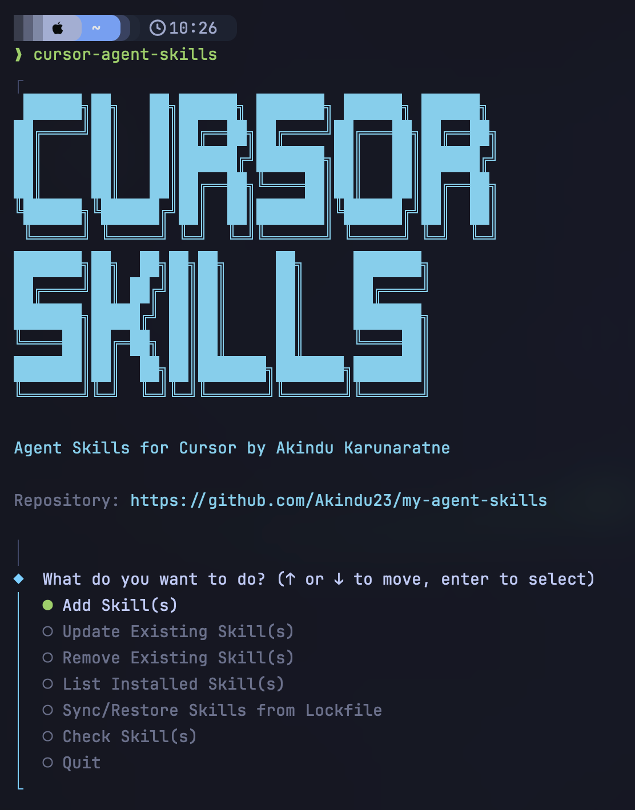

# my-agent-skills

Personal [Cursor Agent Skills](https://cursor.com/docs/skills) tuned for day-to-day engineering work. Skills also work with other agents that load the same `.agents/skills/` layout. Credit for adapted and upstream skills is in **References** below.

---

## Install

**Requires Node ≥ 20.** From any directory, run:

```bash
npx cursor-agent-skills@latest
```

Confirm the `npx` install prompt if asked, then use the interactive menu:



The CLI walks you through **project** (this repo’s `.agents/skills/`) vs **global** (`~/.agents/skills/`) and which skills to install.

Skills land under `.agents/skills/`; what you installed is recorded in `.agents/cursor-skills-lock.json`. Some skills pull in **`dependsOn`** siblings automatically (see [`skills.json`](./skills.json)).

**After cloning a team repo** that commits the lockfile: run the CLI again and choose **Sync/Restore Skills from Lockfile** (same project scope as before). Commit the lockfile to git; gitignore `.agents/skills/` (the installed trees).

Flags like `-p`, `-y`, and `--json` are for scripts and CI only—see `[cli/README.md](./cli/README.md)` if you need those.

### Other installer (optional)

[Vercel’s open skills CLI](https://github.com/vercel-labs/skills) (`npx skills add …`) is a separate ecosystem with different lockfiles and paths. This collection uses **`cursor-agent-skills`** above.

---

## Using skills in Cursor

- Invoke with **`/skill-name`** (matches the `name` in each skill’s `SKILL.md`).
- Cursor discovers skills from **`.agents/skills/`** (project) and **`~/.agents/skills/`** (global), depending on what you installed.

---

## Recommended Cursor plugins

Cursor marketplace plugins that pair well with these skills:

- [Context7](https://cursor.com/marketplace/upstash)
- [Compound Engineering](https://cursor.com/marketplace/every/compound-engineering)
- [Exa](https://cursor.com/marketplace/exa)
- [Thermos](https://cursor.com/marketplace/cursor/thermos)
- [Docs Canvas](https://cursor.com/marketplace/cursor/docs-canvas)
- [Cursor Team Kit](https://cursor.com/marketplace/cursor/cursor-team-kit)
- [Continual Learning](https://cursor.com/marketplace/cursor/continual-learning)

---

## Skill catalog

**36** skills under `[skills/](./skills/)`. Pack manifest: `[skills.json](./skills.json)`.


| Folder                                                                           | `name`                             | One-line intent                                                                                                                                                                                                            | Notes                                                                                                                                                                                                                                                                      |
| -------------------------------------------------------------------------------- | ---------------------------------- | -------------------------------------------------------------------------------------------------------------------------------------------------------------------------------------------------------------------------- | -------------------------------------------------------------------------------------------------------------------------------------------------------------------------------------------------------------------------------------------------------------------------- |
| `[architecture-decision-records](./skills/architecture-decision-records/)`       | `architecture-decision-records`    | Owns lightweight ADRs with detailed rationale, optional expanded sections, scaffolding, and `docs/adr/README.md` index maintenance (draft → approval → write).                                                             | Inspired by [Michael Nygard's ADRs](https://www.cognitect.com/blog/2011/11/15/documenting-architecture-decisions); default is minimal structure, not full Nygard sections.                                                                                                 |
| `[caveman](./skills/caveman/)`                                                   | `caveman`                          | Ultra-compressed communication that trims token usage while keeping full technical accuracy.                                                                                                                               | Inspired by Matt Pocock's skills - **[caveman](https://github.com/mattpocock/skills/tree/main/skills/productivity/caveman)**                                                                                                                                               |
| `[codebase-onboarding](./skills/codebase-onboarding/)`                           | `codebase-onboarding`              | Analyze an unfamiliar codebase and produce a structured onboarding guide, architecture map, conventions, and starter `AGENTS.md` for Cursor.                                                                               | N/A                                                                                                                                                                                                                                                                        |
| `[code-simplifier](./skills/code-simplifier/)`                                   | `code-simplifier`                  | Simplify code for clarity and consistency using project standards from `AGENTS.md` when present, preserving exact behavior.                                                                                                | Use `/code-simplifier`;                                                                                                                                                                                                                                                    |
| `[council](./skills/council/)`                                                   | `council`                          | Explore a codebase area, spawn **Task** subagents for parallel deep dives, then synthesize results (e.g. multi-area review, reconnaissance before planning).                                                               | Self-composed skill; **enum probe** + Composer-family priority for Task `model`; see `[references/cursor-task-workflow.md](./skills/council/references/cursor-task-workflow.md)`.                                                                                          |
| `[design-taste-frontend](./skills/design-taste-frontend/)`                       | `design-taste-frontend`            | Architect premium React/Next.js UIs with metric baselines, strict RSC/Tailwind patterns, Framer Motion rules, and anti-slop guardrails.                                                                                    | Composite style guide skill; verify local edits against any third-party excerpts you merged in.                                                                                                                                                                            |
| `[diagnose](./skills/diagnose/)`                                                 | `diagnose`                         | Disciplined diagnosis loop: reproduce → minimise → hypothesise → instrument → fix → regression-test.                                                                                                                       | Inspired by Matt Pocock's skills - **[diagnose](https://github.com/mattpocock/skills/tree/main/skills/engineering/diagnose)**                                                                                                                                              |
| `[docker-patterns](./skills/docker-patterns/)`                                   | `docker-patterns`                  | Apply Dockerfile, Docker Compose, BuildKit, and container security patterns for local dev and hardened deployable images.                                                                                                  | `origin: ECC` - **[ECC](https://github.com/affaan-m/everything-claude-code)**.                                                                                                                                                                                             |
| `[document](./skills/document/)`                                                 | `document`                         | Create or update durable repo docs (README, API, runbooks) verified against code; prune stale docs in the touched area.                                                                                                    | Adapted from **[hunvreus/skill-issue](https://github.com/hunvreus/skill-issue/tree/main/skills/document)**                                                                                                                                                                 |
| `[explain-code](./skills/explain-code/)`                                         | `explain-code`                     | Explain code in a short, scannable structure (TL;DR, sections, small examples) for walkthroughs or doc-style breakdowns.                                                                                                   | N/A                                                                                                                                                                                                                                                                        |
| `[frontend-design](./skills/frontend-design/)`                                   | `frontend-design`                  | Build distinctive, production-grade frontend interfaces and polished code with strong visual intent while avoiding generic AI-default aesthetics.                                                                          | [Apache License 2.0](./skills/frontend-design/LICENSE.txt); commonly distributed with Claude/Anthropic Compound-style material - respect license text in-tree.                                                                                                             |
| `[frontend-slides](./skills/frontend-slides/)`                                   | `frontend-slides`                  | Create animation-rich HTML presentations from scratch or by converting PowerPoint files.                                                                                                                                   | `origin: ECC`; inspiration credit `**@zarazhangrui`** in body. **[ECC](https://github.com/affaan-m/everything-claude-code)**.                                                                                                                                              |
| `[golang](./skills/golang/)`                                                     | `golang`                           | Route Go work to the right reference guides and conventions for architecture, implementation, concurrency, errors, testing, performance, or review.                                                                        | Some references carry `origin: ECC`. **[ECC](https://github.com/affaan-m/everything-claude-code)**.                                                                                                                                                                        |
| `[gpt-taste](./skills/gpt-taste/)`                                               | `gpt-taste`                        | Elite marketing/React landing UX with GSAP ScrollTrigger discipline, AIDA structure, bento/editorial typography, and strict motion rules.                                                                                  | N/A                                                                                                                                                                                                                                                                        |
| `[grill-me](./skills/grill-me/)`                                                 | `grill-me`                         | Interview the user relentlessly about a plan or design until shared understanding and a resolved decision tree.                                                                                                            | Inspired by Matt Pocock's skills - **[grill-me](https://github.com/mattpocock/skills/tree/main/skills/productivity/grill-me)**                                                                                                                                             |
| `[grill-with-docs](./skills/grill-with-docs/)`                                   | `grill-with-docs`                  | Stress-test a plan against the domain model and documented decisions; update `CONTEXT.md` inline; offer ADRs sparingly and use canonical ADR workflow on acceptance.                                                       | Inspired by Matt Pocock's skills - **[grill-with-docs](https://github.com/mattpocock/skills/tree/main/skills/engineering/grill-with-docs)**                                                                                                                                |
| `[handoff](./skills/handoff/)`                                                   | `handoff`                          | Compact session handoff to a single `docs/handoffs/CURRENT.md`, to be used by another agent in a new session                                                                                                               | Inspired by Matt Pocock's skills - **[handoff](https://github.com/mattpocock/skills/tree/main/skills/productivity/handoff)**; OS temp file only on request.                                                                                                                |
| `[improve-codebase-architecture](./skills/improve-codebase-architecture/)`       | `improve-codebase-architecture`    | Find architectural deepening opportunities using `CONTEXT.md` and ADRs (index-first via `docs/adr/README.md`); HTML report to `docs/architecture-reviews/`; offers ADRs on load-bearing rejections via canonical workflow. | Inspired by Matt Pocock's skills - **[improve-codebase-architecture](https://github.com/mattpocock/skills/tree/main/skills/engineering/improve-codebase-architecture)**; **Task** with enum probe + Composer priority for explore/design passes.                           |
| `[karpathy-guidelines](./skills/karpathy-guidelines/)`                           | `karpathy-guidelines`              | Behavioral guidelines to reduce common LLM coding mistakes when writing, reviewing, or refactoring code.                                                                                                                   | [Andrej Karpathy's notes](https://x.com/karpathy/status/2015883857489522876); `license: MIT`.                                                                                                                                                                              |
| `[mermaid](./skills/mermaid/)`                                                   | `mermaid`                          | Author **[Mermaid](https://mermaid.js.org/)** diagrams for docs and design discussions-many diagram types, ADR/RFC/README-friendly; selection and tooling guides in `references/`.                                         | Adapted from **[WH-2099/mermaid-skill](https://github.com/WH-2099/mermaid-skill)** (MIT) for Cursor `SKILL.md` layout; mirrors upstream syntax/config docs under `references/`.                                                                                            |
| `[postgres-patterns](./skills/postgres-patterns/)`                               | `postgres-patterns`                | PostgreSQL patterns for query optimization, schema design, indexing, and security (Supabase-leaning practice).                                                                                                             | `origin: ECC`; footer cites **[Supabase Agent Skills](https://github.com/supabase/agent-skills)** (MIT). **[ECC](https://github.com/affaan-m/everything-claude-code)** + Supabase team.                                                                                    |
| `[prompt-optimizer](./skills/prompt-optimizer/)`                                 | `prompt-optimizer`                 | Analyze raw prompts, map gaps to Cursor context, and output a ready-to-paste optimized prompt (advisory only - never executes the task).                                                                                   | Maps to Cursor product behavior per [Cursor Skills](https://cursor.com/docs/skills).                                                                                                                                                                                       |
| `[prototype](./skills/prototype/)`                                               | `prototype`                        | Build a throwaway prototype: terminal app for logic/state questions or multiple UI variations on one route.                                                                                                                | Inspired by Matt Pocock's skills - **[prototype](https://github.com/mattpocock/skills/tree/main/skills/engineering/prototype)**                                                                                                                                            |
| `[python-patterns](./skills/python-patterns/)`                                   | `python-patterns`                  | Apply Python idioms, PEP 8 norms, typing, packaging, concurrency, and tooling discipline to everyday Python code.                                                                                                          | `origin: ECC` - **[ECC](https://github.com/affaan-m/everything-claude-code)**.                                                                                                                                                                                             |
| `[recursive-decomposition](./skills/recursive-decomposition/)`                   | `recursive-decomposition`          | Handle oversized tasks via programmatic decomposition and recursive sub-inquiry (RLM-inspired; large docs, many files, huge token spans).                                                                                  | Credits **[massimodeluisa/recursive-decomposition-skill](https://github.com/massimodeluisa/recursive-decomposition-skill)** (MIT); paper [arXiv:2512.24601](https://arxiv.org/abs/2512.24601); pairs with `**council`**.                                                   |
| `[review](./skills/review/)`                                                     | `review`                           | Two-axis diff review (Standards vs Spec) since a user-chosen baseline; parallel `**Task`** runs with `generalPurpose` and explicit `**model**`.                                                                            | Inspired by Matt Pocock's skills - **[review](https://github.com/mattpocock/skills/tree/main/skills/in-progress/review)**. Use `**/review`**. Optional `**/setup-matt-pocock-skills`** for issue-linked specs.                                                             |
| `[setup-matt-pocock-skills](./skills/setup-matt-pocock-skills/)`                 | `setup-matt-pocock-skills`         | Add an `## Agent skills` block in `AGENTS.md`/`CLAUDE.md` and `docs/agents/` so tracker, triage labels, and domain docs are discoverable.                                                                                  | Inspired by Matt Pocock's skills - **[setup-matt-pocock-skills](https://github.com/mattpocock/skills/tree/main/skills/engineering/setup-matt-pocock-skills)**. Run before `**/review`**, `**/to-issues`**, `**/to-prd**`, `**/triage**`, `**/diagnose**`, `**/tdd**`, etc. |
| `[supabase-postgres-best-practices](./skills/supabase-postgres-best-practices/)` | `supabase-postgres-best-practices` | Postgres performance and schema guidance from Supabase: queries, indexes, connection pooling, RLS, and monitoring.                                                                                                         | Upstream **[supabase/agent-skills](https://github.com/supabase/agent-skills)** (MIT pack version noted in SKILL).                                                                                                                                                          |
| `[tdd](./skills/tdd/)`                                                           | `tdd`                              | Test-driven development with the red–green–refactor loop and disciplined tests.                                                                                                                                            | Inspired by Matt Pocock's skills - **[tdd](https://github.com/mattpocock/skills/tree/main/skills/engineering/tdd)**                                                                                                                                                        |
| `[teach](./skills/teach/)`                                                       | `teach`                            | Teach a topic over multiple sessions with `docs/learning/<topic-slug>/` artifacts, Exa-verified resources, learning records, exercises, and HTML explainers.                                                               | Inspired by Matt Pocock's skills - **[teach](https://github.com/mattpocock/skills/tree/main/skills/in-progress/teach)**. Use `**/teach`**.                                                                                                                                 |
| `[to-issues](./skills/to-issues/)`                                               | `to-issues`                        | Break a plan, spec, or PRD into tracer-bullet vertical slices as issues on the project tracker.                                                                                                                            | Inspired by Matt Pocock's skills - **[to-issues](https://github.com/mattpocock/skills/tree/main/skills/engineering/to-issues)**. Run `**/setup-matt-pocock-skills`** first.                                                                                                |
| `[to-prd](./skills/to-prd/)`                                                     | `to-prd`                           | Turn the current conversation context into a PRD and publish it to the project issue tracker.                                                                                                                              | Inspired by Matt Pocock's skills - **[to-prd](https://github.com/mattpocock/skills/tree/main/skills/engineering/to-prd)**. Run `**/setup-matt-pocock-skills`** first.                                                                                                      |
| `[triage](./skills/triage/)`                                                     | `triage`                           | Triage issues through a state machine driven by triage roles (create, AFK handoff, workflow).                                                                                                                              | Inspired by Matt Pocock's skills - **[triage](https://github.com/mattpocock/skills/tree/main/skills/engineering/triage)**                                                                                                                                                  |
| `[vercel-react-best-practices](./skills/vercel-react-best-practices/)`           | `vercel-react-best-practices`      | React and Next.js performance rules from Vercel Engineering (RSC, data fetching, bundle size, re-renders, waterfalls).                                                                                                     | **[vercel-labs/agent-skills](https://github.com/vercel-labs/agent-skills)** (“react-best-practices” pack; MIT); see also Shu Ding's **[Introducing React Best Practices](https://vercel.com/blog/introducing-react-best-practices)**.                                      |
| `[web-design-guidelines](./skills/web-design-guidelines/)`                       | `web-design-guidelines`            | Review UI code for **Web Interface Guidelines** compliance (accessibility, UX, best-practice audits).                                                                                                                      | Upstream guideline file in **[vercel-labs/web-interface-guidelines](https://github.com/vercel-labs/web-interface-guidelines)** (see SKILL frontmatter metadata).                                                                                                           |
| `[zoom-out](./skills/zoom-out/)`                                                 | `zoom-out`                         | Zoom out for broader context: map relevant modules, callers, and domain vocabulary at a higher level of abstraction.                                                                                                       | Inspired by Matt Pocock's skills - **[zoom-out](https://github.com/mattpocock/skills/tree/main/skills/engineering/zoom-out)**.                                                                                                                                             |


---

## Repository layout


| Path                           | Purpose                                                                       |
| ------------------------------ | ----------------------------------------------------------------------------- |
| `[skills/](./skills/)`         | Skill definitions (`SKILL.md`, optional `references/`, `scripts/`, `assets/`) |
| `[skills.json](./skills.json)` | Pack manifest, skill list, `dependsOn`, pinned `packCommit`                   |
| `[cli/](./cli/)`               | `**cursor-agent-skills`** npm package source                                  |
| `[CONTEXT.md](./CONTEXT.md)`   | Terminology for the custom installer                                          |


---

## References

### Cursor and the skills format

- **[Agent Skills (open ecosystem)](https://agentskills.io/)**
- **[Cursor — Agent Skills](https://cursor.com/docs/skills)**

### Major upstream packs


| Source                                                                                                              | Notes                                                                                                         |
| ------------------------------------------------------------------------------------------------------------------- | ------------------------------------------------------------------------------------------------------------- |
| **[mattpocock/skills](https://github.com/mattpocock/skills)**                                                       | Productivity and engineering workflows (MIT)                                                                  |
| **[hunvreus/skill-issue](https://github.com/hunvreus/skill-issue)**                                                 | `[document](./skills/document/)` skill                                                                        |
| **[vercel-labs/agent-skills](https://github.com/vercel-labs/agent-skills)**                                         | React best practices; **[web-interface-guidelines](https://github.com/vercel-labs/web-interface-guidelines)** |
| **[supabase/agent-skills](https://github.com/supabase/agent-skills)**                                               | Postgres guidance                                                                                             |
| **[massimodeluisa/recursive-decomposition-skill](https://github.com/massimodeluisa/recursive-decomposition-skill)** | RLM-inspired decomposition; [paper](https://arxiv.org/abs/2512.24601)                                         |
| **[Everything Claude Code](https://github.com/affaan-m/everything-claude-code)**                                    | Claude Code skills adapted for cursor.                                                                        |


Per-skill attribution and licenses are in each skill’s `SKILL.md` and the catalog **Notes** column above.