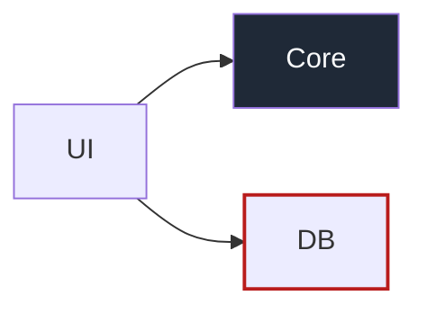
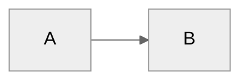

# Styling (opt-in)

Reached only when the caller asks for colour, emphasis, or a theme.

## Highlight a class of nodes or edges

`classDef` plus `class` is the portable path; it renders on GitHub and Obsidian.

`:::leak` inline on a node (`db["DB"]:::leak`) is the same binding in one line.

## Theme

YAML frontmatter is the Mermaid 11 form:

GitHub's bundled Mermaid lags; when the frontmatter form is ignored there, the init directive still works:

