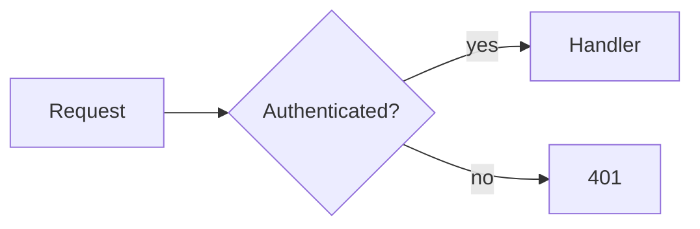
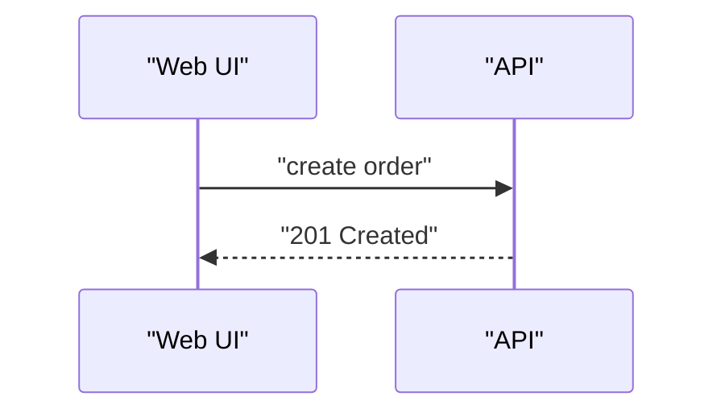
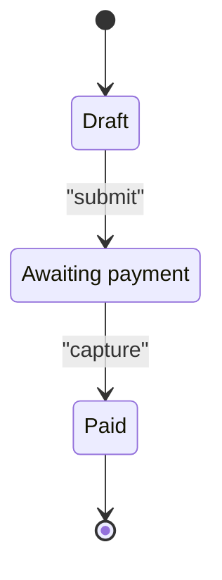
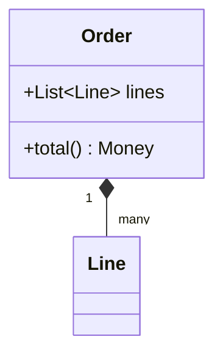
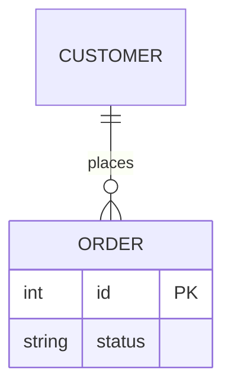

# Types

Five types render on GitHub, Obsidian, and VS Code / Cursor preview. `architecture-beta`, `kanban`, `radar`, `block-beta`, `xychart-beta`, and `packet` need a newer Mermaid than those bundle.

| Need | Type | First line |
| --- | --- | --- |
| Process, decision, module graph | flowchart | `flowchart LR` |
| Calls or messages over time | sequence | `sequenceDiagram` |
| Lifecycle, status transitions | state | `stateDiagram-v2` |
| Types and their relations | class | `classDiagram` |
| Entities and cardinality | ER | `erDiagram` |

## flowchart

- Edge labels are quoted like node labels: `-->|"yes"|`.
- Arrows: `-->` solid, `-.->` dashed (optional or async), `==>` thick (emphasis), `~~~` invisible (layout only).
- Shapes: `[" "]` box, `(" ")` rounded, `{" "}` decision, `([" "])` terminal, `[(" ")]` store.
- `direction` inside a subgraph is dropped whenever the subgraph has edges to outside nodes. Treat it as best-effort.
- Subgraph titles stay short and single-line; long titles overlap the first row.

## sequenceDiagram

- Multi-word aliases are quoted: `participant ui as "Web UI"`.
- Message text avoids `<`, `>`, and `;`. Write `List of Item`, not `List<Item>`.
- `->>` sync, `-->>` reply, `-x` lost. `activate` / `deactivate` and `autonumber` are stable.

## stateDiagram-v2

- `[*]` is start and end.
- Names with spaces use `state "Long name" as id`, then reference `id`.

## classDiagram

- Generics use tildes: `List~Item~`.
- Relations read source to target: `<|--` inheritance, `*--` composition, `o--` aggregation, `-->` association, `..>` dependency.

## erDiagram

- Cardinality glyphs: `||` exactly one, `o|` zero or one, `}|` one or more, `o{` zero or more.
- Entity names with `::`, spaces, or punctuation are quoted: `"Service::User"`.
- Attribute comments are double-quoted and hold no inner quotes.
