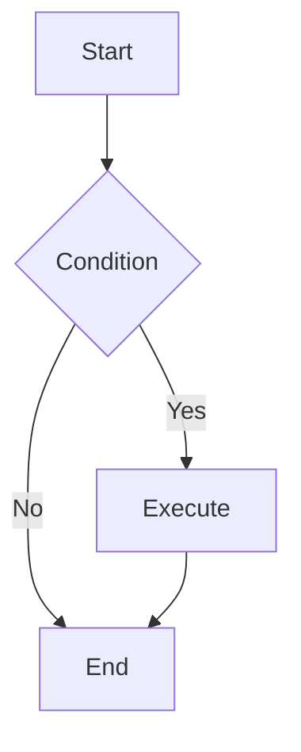

# Mermaid diagrams

_Adapted from [WH-2099/mermaid-skill](https://github.com/WH-2099/mermaid-skill) (MIT); reorganized for Cursor Agent Skills (`SKILL.md` + local `references/`)._

Produce correct, readable Mermaid source from the user’s goals. Prefer the workflow below over guessing syntax.

## When to use

- Starting or scoping work where a shared picture reduces ambiguity (features, refactors, integrations).
- Documenting architecture, data models, APIs, or operational flows.
- Explaining decisions in ADRs, RFCs, or README sections where a diagram clarifies context or options.
- Onboarding and cross-team alignment on structure, boundaries, and responsibilities.

## Workflow

1. **Understand requirements**: Infer the best diagram type from intent (see [diagram selection](references/diagram-selection.md)).
2. **Read the type reference**: Open the matching file under [Diagram type reference](#diagram-type-reference) for syntax details.
3. **Generate code**: Write minimal valid Mermaid that renders; add structure before cosmetics.
4. **Style if needed**: Use [theming](references/config-theming.md) / [directives](references/config-directives.md) only when it improves clarity.

## Guides (read from this skill only)

- [Diagram selection](references/diagram-selection.md) — match intent to diagram type and per-type references.
- [Authoring and pitfalls](references/authoring-and-pitfalls.md) — structure, comments, common failures; defer edge cases to [mermaid.js.org](https://mermaid.js.org/).
- [Tooling and export](references/tooling-and-export.md) — GitHub/GitLab, editors, Live Editor, CLI, Docker.
- [Frontmatter in diagrams](references/mermaid-frontmatter-in-diagrams.md) — YAML `config`, `look`, ELK hints; links into upstream-mirrored config docs.

## Diagram type reference

Select the appropriate diagram type and read the corresponding documentation:

| Type | Documentation | Use cases |
| ---- | ------------- | --------- |
| Flowchart | [flowchart.md](references/flowchart.md) | Processes, decisions, steps |
| Sequence Diagram | [sequenceDiagram.md](references/sequenceDiagram.md) | Interactions, messaging, API calls |
| Class Diagram | [classDiagram.md](references/classDiagram.md) | Class structure, inheritance, associations |
| State Diagram | [stateDiagram.md](references/stateDiagram.md) | State machines, state transitions |
| ER Diagram | [entityRelationshipDiagram.md](references/entityRelationshipDiagram.md) | Database design, entity relationships |
| Gantt Chart | [gantt.md](references/gantt.md) | Project planning, timelines |
| Pie Chart | [pie.md](references/pie.md) | Proportions, distributions |
| Mindmap | [mindmap.md](references/mindmap.md) | Hierarchical structures, knowledge graphs |
| Timeline | [timeline.md](references/timeline.md) | Historical events, milestones |
| Git Graph | [gitgraph.md](references/gitgraph.md) | Branches, merges, versions |
| Quadrant Chart | [quadrantChart.md](references/quadrantChart.md) | Four-quadrant analysis |
| Requirement Diagram | [requirementDiagram.md](references/requirementDiagram.md) | Requirements traceability |
| C4 Diagram | [c4.md](references/c4.md) | System architecture (C4 model) |
| Sankey Diagram | [sankey.md](references/sankey.md) | Flow, conversions |
| XY Chart | [xyChart.md](references/xyChart.md) | Line charts, bar charts |
| Block Diagram | [block.md](references/block.md) | System components, modules |
| Packet Diagram | [packet.md](references/packet.md) | Network protocols, data structures |
| Kanban | [kanban.md](references/kanban.md) | Task management, workflows |
| Architecture Diagram | [architecture.md](references/architecture.md) | System architecture |
| Radar Chart | [radar.md](references/radar.md) | Multi-dimensional comparison |
| Treemap | [treemap.md](references/treemap.md) | Hierarchical data visualization |
| User Journey | [userJourney.md](references/userJourney.md) | User experience flows |
| ZenUML | [zenuml.md](references/zenuml.md) | Sequence diagrams (code style) |

## Configuration & themes

- [Theming](references/config-theming.md) — colors and themes
- [Directives](references/config-directives.md) — per-diagram configuration (legacy `%%` init)
- [Layouts](references/config-layouts.md) — layout algorithms (dagre, elk, …)
- [Configuration](references/config-configuration.md) — global and frontmatter configuration
- [Math](references/config-math.md) — LaTeX math support

## Output specification

Generated Mermaid should:

1. Live in Markdown fenced code blocks with the `mermaid` info string when embedded in Markdown.
2. Parse and render without errors in common viewers (validate in [Live Editor](https://mermaid.live) when unsure).
3. Use clear structure: line breaks, indentation, and semantic node/participant names.
4. Add styling or themes only when they clarify the message.

## Example

