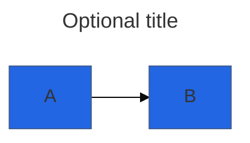

# Frontmatter in diagrams (skill companion)

Upstream mirrors under `references/config-*.md` are the canonical detail. This file only adds short **deltas** and cross-links so agents do not edit autogenerated upstream copies.

## YAML block

Diagram-local configuration uses a YAML frontmatter block at the top of the diagram body, then the diagram text:



See [config-configuration.md](config-configuration.md) and [config-theming.md](config-theming.md).

## `look`

Controls sketch vs classic styling (supported combinations depend on diagram type and version):

- `look: classic` — default polished appearance
- `look: handDrawn` — informal sketch style

Set under `config:` in frontmatter. Details: official **Configuration** / theming docs on [mermaid.js.org](https://mermaid.js.org/).

## Layout: ELK extras

With `layout: elk`, flow-like diagrams can take an `elk` subsection, for example:

```yaml
config:
  layout: elk
  elk:
    mergeEdges: true
    nodePlacementStrategy: BRANDES_KOEPF
```

**`nodePlacementStrategy`** values commonly referenced: `SIMPLE`, `NETWORK_SIMPLEX`, `LINEAR_SEGMENTS`, `BRANDES_KOEPF`. See [config-layouts.md](config-layouts.md) and upstream ELK/Mermaid docs for availability.

## Styling in-diagram

Flowcharts support `classDef`, `style`, `linkStyle`, `click`, subgraph styling, etc.—see [flowchart.md](flowchart.md). Sequence and class diagrams may use init directives or theme variables per [config-directives.md](config-directives.md).

## Accessibility and weight

- Prefer contrast-friendly `themeVariables` when publishing externally (see [config-theming.md](config-theming.md)).
- Very large graphs: consider `layout: elk`, edge merging, or splitting diagrams—see [config-layouts.md](config-layouts.md).

## Export CLI snapshots

For **`mmdc`** raster/SVG export, dimension and background flags are common (`-w`, `-H`, `-b`); see [tooling-and-export.md](tooling-and-export.md).
